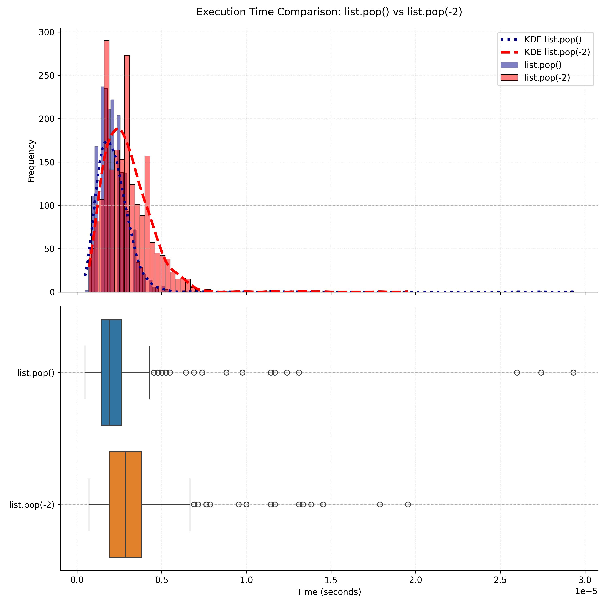

# Statistical list.pop Performance Evaluation

## Overview

This repository contains a comprehensive analysis of the performance of the `list.pop()` and `list.pop(-2)` operations in Python. The analysis involves statistical tests to compare execution times and determine if there is a significant difference between the two operations. The project includes detailed explanations of the tests conducted, visualizations, and conclusions based on the results.

## Repository Structure

- `data/`: Contains samples data used for performance evaluation.
- `notebooks/`: Jupyter notebook with detailed analysis and visualization.
- `plots/`: Generated plot from the analysis.

## Installation

To get started with this project, follow these steps:

1. **Clone the Repository:**

   ```bash
   git clone https://github.com/andreypomortsev/statistical-list.pop-performance-evaluation.git
   cd statistical-list.pop-performance-evaluation
   ```

2. **Create a Virtual Environment:**

   ```bash
   python3 -m venv .venv
   ```

3. **Activate the Virtual Environment:**

   - On macOS and Linux:

     ```bash
     source .venv/bin/activate
     ```

   - On Windows:

     ```bash
     .venv\Scripts\activate
     ```

4. **Install Dependencies:**

   ```bash
   pip install -r requirements.txt
   ```

These steps will set up the environment and install the necessary packages for running the analysis.


## Usage

1. **Run the Analysis:**
   Execute the main script or Jupyter notebook to perform the performance evaluation and statistical analysis.

2. **View Results:**
   Results and visualizations will be saved in the `plots/` directory.


## Statistical Tests Performed

1. **Shapiro-Wilk Test:** To check the normality of the data distributions.
2. **Levene's Test:** To check the equality of variances between the two operations.
3. **Mann-Whitney U Test:** Non-parametric test used when normality assumptions are not met.

### Conclusion

Based on the results of the statistical tests, we can conclude whether there is a significant difference in the performance of `list.pop()` compared to `list.pop(-2)`. Detailed explanations and percentage differences are provided in the analysis.

## License

This project is licensed under the MIT License. See the [LICENSE](LICENSE) file for more details.

## Contact

For any questions or suggestions, please reach out to [Andrei Pomortsev](https://www.linkedin.com/in/andreypomortsev/).
